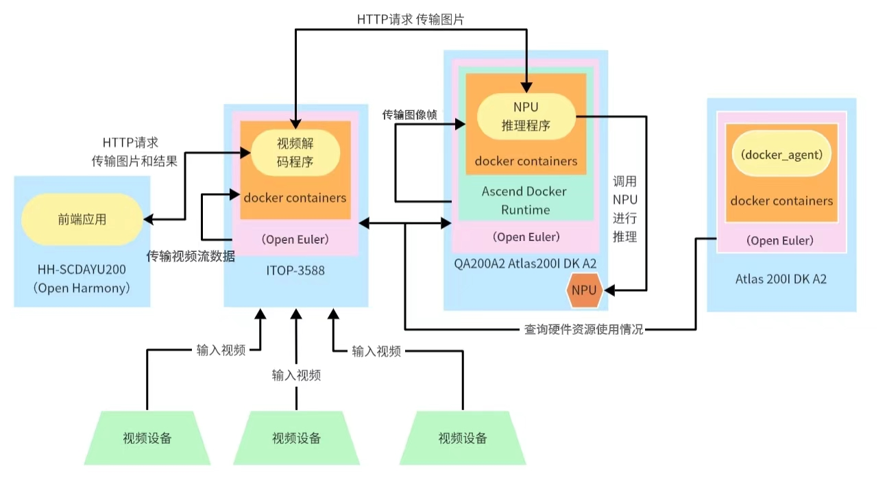
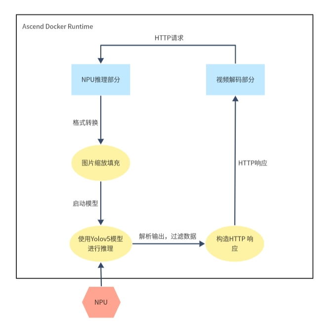
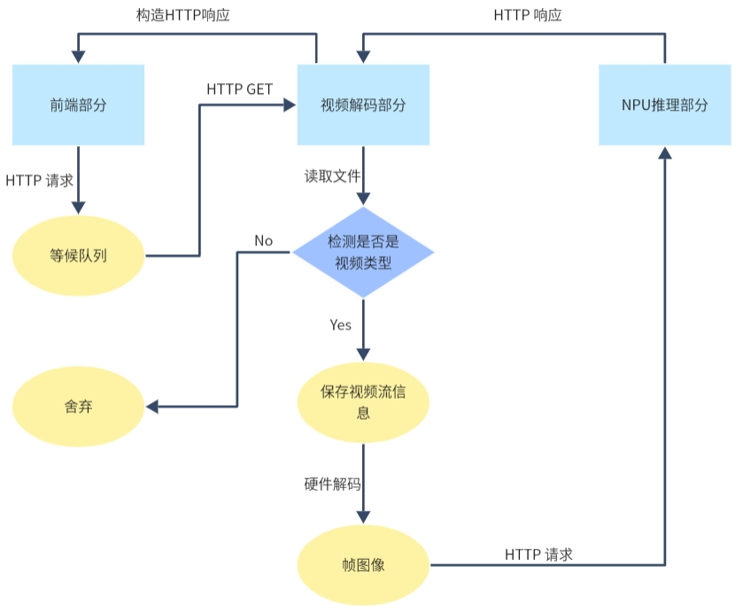
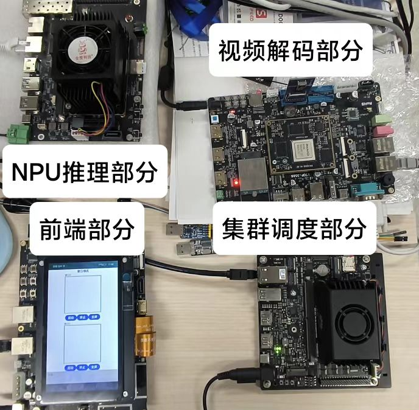

# 基于边缘的异构多功能AI推理集群

## 分工和协作

| 姓名   | 主要负责工作                                                                                      |
| ------ | ------------------------------------------------------------------------------------------------- |
| 邹先予 | 负责rk3588相关ai应用和docker_agent模块的程序编写。                            |
| 岳志鑫 | 负责atlas的相关ai应用和鸿蒙前端的程序编写。 |
| 林雪松 | 负责scheduler模块的程序编写以及docker容器调度等工作。                                     |


## 系统框架设计
我们的异构集群内包含多种运算资源，为了应用多种功能的ai推理应用，将每个ai推理容器都进行容器化适配，开发板都部署docker容器，便于系统迅速的进行任务分配和容器启动。使用一个图像识别应用，接收多个视频设备传入的视频，分别通过视频解码和图像推理识别的过程，最后用一个开发板作为前端进行展示。测试系统是否能迅速合理分配视频解码任务和识别任务，计算容器启动时间、系统吞吐量、应用响应延迟和各个部分的负载均衡等指标，观察其是否具有高效的管理和调度机制对接收到的任务进行处理，并为每个任务找到最合适的硬件执行器。
- 前端部分：DAYU200开发板部署Open Harmony 4.0 Release系统，开发一个前端程序向视频解码部分获取后端数据并可视化显示在屏幕上。
- 集群调度部分：Atlas 200I DK A2开发板安装 docker ，容器内部署docker_agent程序进行硬件资源的监控和获取。
- 推理部分：QA200A2 Atlas200I DK A2开发板部署 OpenEuler 22.03 LTS SP1 和docker，接收视频解码部分发送的HTTP 请求后拉起docker并运行推理程序进行推理，将推理结果返回给视频解码部分。
- 视频解码部分：iTOP-3588 开发板部署 OpenEuler 22.03 LTS SP1 和docker，在容器内部署多路解码程序，将收到的视频设备的视频解码为帧图像发送给NPU推理部分，将NPU推理部分返回的结果传输给前端部分。

整体架构图如图所示：



## 开发流程
### 前端部分

使用搭载了 Rockchip RK3568 芯片的润和 HH-SCDAYU200 开发板作为前端开发板。在此开发板上部署鸿蒙系统，开发一个前端显示程序。

具体步骤如：发送 HTTP 请求获取结果，将获取的结果拆分为推理结果和图像数据。利用鸿蒙开发的 ArkTS 和Native C++ 将图像数据转为图片显示在 Canvas 画板上，将推理结果内的坐标、标签、概率等属性绘制成矩形框显示在画板上，通过不断发送 HTTP 请求和刷新画板，最终实现视频的效果。同时开发多线程，保证多窗口场景下的高效性。具体前端部分流程如图所示：


### 集群调度部分

使用 Atlas 200I DK A2 开发者套件部署 k3s 等系统，对接收的信息进行分析，并调用合适的系统进行资源调度。

具体步骤如：使用 docker 容器，通过判断当前系统的负载来调度不同的任务，包括但不限于启动多个容器或将任务进行迁移。

### NPU推理部分

使用 QA200A2 Atlas200I DK A2开发者套件  开发者套件部署 docker 并利用容器进行 NPU 推理。

具体步骤如：使用 Yolov5 模型编写一个 C++ 推理程序。首先从文件中读取图像数据，使用 OpenCV 创建图像矩阵 img，调用华为 Ascend AI 处理器的 ACL（Ascend Computing Language）API交互，用于模型的初始化、加载和执行，然后调用 Yolov5 的模型进行推理，并输出最后的检测信息，设置 HTTP 服务器和多线程保证有效的传输和推理。具体NPU推理部分流程如图所示：



### 视频解码部分

使用搭载了 Rockchip RK3588 芯片的迅为iTOP-3588开发板，在此开发板上开发一个容器内的多线程解析视频的视频流处理系统。

具体步骤如：使用 httplib 库创建 HTTP 服务器，使用 FFmpeg 库来完成初始化网络、打开视频流、查找视频流信息、打开解码器和创建缩放上下文等工作，将最后转换出的格式使用 HTTP 传输，设置多线程保证任务量集中时仍能保持高效的视频解码处理。具体视频解码部分流程如图所示：



如下图所示，各个部分之间进行数据传输和调用，形成了完整的嵌入式集群系统。视频解码部分将视频流拆分成图像帧，并传输给 NPU 推理部分进行处理。推理结果返回给视频解码部分后，通过前端部分进行可视化显示。集群调度部分则在后台进行资源管理、负载均衡和各个部分的数据传输，确保系统在高负载情况下依然能够高效运行。


整体连接如图所示：



前端显示测试(GIF)：


## 仓库文件描述
```
├─ 📁atlas200dk
│  ├─ 📁bert
│  │  ├─ 📁acllite                         // 华为Ascend AI处理器的ACL(Ascend Computing Language)API
│  │  ├─ 📁scripts                         // 文字识别的数据集和分类标签
│  │  ├─ 📁model                           // bert的om模型
│  │  ├─ 📁src                             // bert分类程序代码
│  │  ├─ 📄Dockerfile                      // 制作包含所有运行环境和库文件的 docker image 语句 
│  │  ├─ 📄README.md                       // 启动docker的挂载命令和程序接口说明等
│  │  └─ 📄repo.txt                        // 与 dockerfile 配套使用，用于更换 OpenEuler 的 yum 源
│  ├─ 📁deeplabv3
│  │  ├─ 📁acl                             // 华为Ascend AI处理器的ACL(Ascend Computing Language)API
│  │  ├─ 📁acllite                         // 华为Ascend AI处理器的ACL(Ascend Computing Language)API
│  │  ├─ 📁model                           // deeplabv3的om模型
│  │  ├─ 📁src                             // 调用NPU进行推理的程序代码
│  │  ├─ 📄Dockerfile                      // 制作包含所有运行环境和库文件的 docker image 语句 
│  │  ├─ 📄README.md                       // 启动docker的挂载命令和程序接口说明等
│  │  └─ 📄repo.txt                        // 与 dockerfile 配套使用，用于更换 OpenEuler 的 yum 源
│  ├─ 📁mobilenetv3
│  │  ├─ 📁acllite                         // 华为Ascend AI处理器的ACL(Ascend Computing Language)API
│  │  ├─ 📁model                           // mobilenetv3的om模型
│  │  ├─ 📁src                             // 调用NPU进行推理的程序代码
│  │  ├─ 📄Dockerfile                      // 制作包含所有运行环境和库文件的 docker image 语句 
│  │  ├─ 📄README.md                       // 启动docker的挂载命令和程序接口说明等
│  │  └─ 📄repo.txt                        // 与 dockerfile 配套使用，用于更换 OpenEuler 的 yum 源
│  ├─ 📁resnet50
│  │  ├─ 📁acl                             // 华为Ascend AI处理器的ACL(Ascend Computing Language)API
│  │  ├─ 📁model                           // resnet50的om模型
│  │  ├─ 📁src                             // 调用NPU进行推理的程序代码
│  │  ├─ 📄Dockerfile                      // 制作包含所有运行环境和库文件的 docker image 语句 
│  │  ├─ 📄README.md                       // 启动docker的挂载命令和程序接口说明等
│  │  └─ 📄repo.txt                        // 与 dockerfile 配套使用，用于更换 OpenEuler 的 yum 源
│  ├─ 📁transcoding
│  │  ├─ 📁acl                             // 华为Ascend AI处理器的ACL(Ascend Computing Language)API
│  │  ├─ 📁data                            // 可存放输出的视频
│  │  ├─ 📁src                             // 视频转码的代码
│  │  ├─ 📄Dockerfile                      // 制作包含所有运行环境和库文件的 docker image 语句 
│  │  ├─ 📄README.md                       // 启动docker的挂载命令和程序接口说明等
│  │  └─ 📄repo.txt                        // 与 dockerfile 配套使用，用于更换 OpenEuler 的 yum 源
│  ├─ 📁yolov5-infer-cpp
│  │  ├─ 📁acl                             // 华为Ascend AI处理器的ACL(Ascend Computing Language)API
│  │  ├─ 📁lib64                           // 相关库文件
│  │  ├─ 📁model                           // yolov5的om模型
│  │  ├─ 📁src                             // 调用NPU进行推理的程序代码
│  │  ├─ 📄CMakeLists.txt
│  │  ├─ 📄Dockerfile                      // 制作包含所有运行环境和库文件的 docker image 语句 
│  │  ├─ 📄README.md                       // 启动docker的挂载命令和程序接口说明等
│  │  └─ 📄repo.txt                        // 与 dockerfile 配套使用，用于更换 OpenEuler 的 yum 源
├─ 📁DAYU200
│  └─ 📁serverless
│     ├─ 📁APPScore
│     ├─ 📁entry
│     │  ├─ 📁libs                         // 存放OpenCV库文件
│     │  ├─ 📁oh_modules                   // c++与ArkTS代码的绑定库
│     │  └─ 📁src
│     │     └─ 📁main
│     │        ├─ 📁cpp
│     │        │  ├─ 📁common
│     │        │  │  └─ 📄common.cpp       // OpenCV相关代码
│     │        │  ├─ 📁include             // OpenCV相关库文件
│     │        │  ├─ 📁types
│     │        │  ├─ 📄CmakeLists.txt
│     │        │  └─ 📄hello.cpp           // 实现HTTP请求和响应结果处理
│     │        ├─ 📁ets
│     │        │  ├─ 📁enttyability
│     │        │  ├─ 📁pages
│     │        │  │  └─ 📄index.ets        // 前端主要页面代码
│     │        │  └─ 📁util                // 工具类
│     │        └─ 📁resources 
│     │           └─ 📄module.json         // 更改权限代码
│     ├─ 📁hvigor
│     └─ 📁oh_modules
├─ 📁rk3588
│   ├─ 📁resnet_rk3588_v1
│   │  ├─ 📁lib                            //图像分类程序的lib库
│   │  ├─ 📁model                          //图像分类程序的模型
│   │  ├─ 📁src                            //图像分类程序的源代码
│   │  ├─ 📄Dockerfile                     //制作包含所有运行环境和库文件的 docker image 语句 
│   │  ├─ 📄CMakeLists                     
│   │  └─ 📄README.md                      //启动docker的挂载命令和程序接口说明等.  
│   ├─ 📁video_decoder_docker_multiway_v3
│   │  ├─ 📁src                            //视频解码程序的源代码
│   │  ├─ 📄Dockerfile                     //制作包含所有运行环境和库文件的 docker image 语句 
│   │  └─ 📄README.md                      //启动docker的挂载命令和程序接口说明等.  
│   └─ 📁video_transcoder_docker_multiway_v1
│      ├─ 📁src                            //视频转码程序的源代码
│      ├─ 📄Dockerfile                     //制作包含所有运行环境和库文件的 docker image 语句 
│      └─ 📄README.md                      //启动docker的挂载命令和程序接口说明等.  
└─ 📄README.md                             //简要说明文档
```